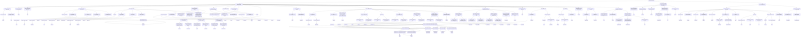

```mermaid
stateDiagram-v2
    Init: Operator Decision Tree 
    0c93:I have one existing Observable, and
    Init --> 0c93
    cedb:I want to change each emitted value
    0c93 --> cedb
    ea32:to be a constant value
    cedb --> ea32
    403d:mapTo
    ea32 --> 403d
    f855:to be a value calculated through a formula
    cedb --> f855
    8ce0:map
    f855 --> 8ce0
    b05d:I want to pick a property off each emitted value
    0c93 --> b05d
    93fd:pluck
    b05d --> 93fd
    8d26:I want to spy the values being emitted without affecting them
    0c93 --> 8d26
    777c:tap
    8d26 --> 777c
    5583:I want to allow some values to pass
    0c93 --> 5583
    df20:based on custom logic
    5583 --> df20
    ac73:I want to prepend one value
    df20 --> ac73
    b25f:startWith
    ac73 --> b25f
    2960:if they are at the start of the Observable
    5583 --> 2960
    5771:and only the first value
    2960 --> 5771
    b312:first
    5771 --> b312
    e4b6:based on a given amount
    2960 --> e4b6
    25b7:take
    e4b6 --> 25b7
    bbfb:based on custom logic
    2960 --> bbfb
    324b:takeWhile
    bbfb --> 324b
    3fd4:if they are exactly the n-th emission
    5583 --> 3fd4
    7f19:elementAt
    3fd4 --> 7f19
    0659:if they are at the end of the Observable
    5583 --> 0659
    13f0:and only the last value
    0659 --> 13f0
    a6fa:last
    13f0 --> a6fa
    ec44:based on a given amount
    0659 --> ec44
    c0c2:takeLast
    ec44 --> c0c2
    0f5d:until another Observable emits a value
    5583 --> 0f5d
    9798:takeUntil
    0f5d --> 9798
    6c88:I want to ignore values
    0c93 --> 6c88
    20d3:altogether
    6c88 --> 20d3
    d2ec:ignoreElements
    20d3 --> d2ec
    0233:from the start of the Observable
    6c88 --> 0233
    cc61:based on a given amount
    0233 --> cc61
    1637:skip
    cc61 --> 1637
    d5f7:based on custom logic
    0233 --> d5f7
    3c36:skipWhile
    d5f7 --> 3c36
    02fb:from the end of the Observable
    6c88 --> 02fb
    d64d:skipLast
    02fb --> d64d
    1f25:until another Observable emits a value
    6c88 --> 1f25
    3552:skipUntil
    1f25 --> 3552
    a467:I want to know how many values it emits
    6c88 --> a467
    e58c:count
    a467 --> e58c
    d596:that occur too frequently
    6c88 --> d596
    9ef0:by emitting the first value in each time window
    d596 --> 9ef0
    c4fb:where time windows are determined by another Observable's emissions
    9ef0 --> c4fb
    dc8b:throttle
    c4fb --> dc8b
    6118:where time windows are determined by a time duration
    9ef0 --> 6118
    d32c:throttleTime
    6118 --> d32c
    5388:by emitting the last value in each time window
    d596 --> 5388
    330a:where time windows are determined by another Observable's emissions
    5388 --> 330a
    a0ac:audit
    330a --> a0ac
    960f:where time windows are determined by a time duration
    5388 --> 960f
    b242:auditTime
    960f --> b242
    0871:by emitting the last value as soon as enough silence has occurred
    d596 --> 0871
    908c:where the silence duration threshold is determined by another Observable
    0871 --> 908c
    1c28:debounce
    908c --> 1c28
    70df:where the silence duration threshold is determined by a time duration
    0871 --> 70df
    15e0:debounceTime
    70df --> 15e0
    e254:I want to compute a formula using all values emitted
    0c93 --> e254
    1d21:and only output the final computed value
    e254 --> 1d21
    7c9d:reduce
    1d21 --> 7c9d
    1c18:and output the computed values when the source emits a value
    e254 --> 1c18
    bbc1:scan
    1c18 --> bbc1
    b302:and output the computed values as a nested Observable when the source emits a value
    e254 --> b302
    284c:mergeScan
    b302 --> 284c
    6733:and output the computed values as a nested Observable when the source emits a value while unsubscribing from the previous nested Observable
    e254 --> 6733
    9990:switchScan
    6733 --> 9990
    b96b:I want to wrap its messages with metadata
    0c93 --> b96b
    86d3:that describes each notification (next, error, or complete)
    b96b --> 86d3
    f1de:materialize
    86d3 --> f1de
    d1de:that includes the time past since the last emitted value
    b96b --> d1de
    3db8:timeInterval
    d1de --> 3db8
    22ba:after a period of inactivity
    0c93 --> 22ba
    48db:I want to throw an error
    22ba --> 48db
    c7c0:timeout
    48db --> c7c0
    ec20:I want to switch to another Observable
    22ba --> ec20
    f627:timeoutWith
    ec20 --> f627
    8c3c:I want to ensure there is only one value
    0c93 --> 8c3c
    7323:single
    8c3c --> 7323
    a467:I want to know how many values it emits
    0c93 --> a467
    e58c:count
    a467 --> e58c
    ac73:I want to prepend one value
    0c93 --> ac73
    b25f:startWith
    ac73 --> b25f
    b5b5:I want to delay the emissions
    0c93 --> b5b5
    45c1:based on a given amount of time
    b5b5 --> 45c1
    1e04:delay
    45c1 --> 1e04
    bdac:based on the emissions of another Observable
    b5b5 --> bdac
    6406:delayWhen
    bdac --> 6406
    2ecb:I want to group the values
    0c93 --> 2ecb
    cd10:until the Observable completes
    2ecb --> cd10
    efe5:and convert to an array
    cd10 --> efe5
    0695:toArray
    efe5 --> 0695
    b0fd:and convert to a Promise
    cd10 --> b0fd
    72f1:Observable
    b0fd --> 72f1
    f1a9:consecutively in pairs, as arrays
    2ecb --> f1a9
    4a37:pairwise
    f1a9 --> 4a37
    cd88:based on a criterion, and output two Observables those that match the criterion and those that do not
    2ecb --> cd88
    0473:partition
    cd88 --> 0473
    7741:in batches of a particular size
    2ecb --> 7741
    af8f:and emit the group as an array
    7741 --> af8f
    ac8e:I want to share a subscription between multiple subscribers
    af8f --> ac8e
    0f80:using a conventional Subject
    ac8e --> 0f80
    f673:and start it as soon as the first subscriber arrives
    0f80 --> f673
    d363:share
    f673 --> d363
    c549:and start it manually or imperatively
    0f80 --> c549
    cd1b:publish
    c549 --> cd1b
    39e4:using a BehaviorSubject
    ac8e --> 39e4
    1966:publishBehavior
    39e4 --> 1966
    1c87:using a ReplaySubject
    ac8e --> 1c87
    d164:publishReplay
    1c87 --> d164
    d281:using an AsyncSubject
    ac8e --> d281
    54b5:publishLast
    d281 --> 54b5
    ef3d:using a specific subject implementation
    ac8e --> ef3d
    df7c:multicast
    ef3d --> df7c
    f114:and emit the group as a nested Observable
    7741 --> f114
    b551:windowCount
    f114 --> b551
    d89a:based on time
    2ecb --> d89a
    24a6:and emit the group as an array
    d89a --> 24a6
    9b8c:bufferTime
    24a6 --> 9b8c
    111c:and emit the group as a nested Observable
    d89a --> 111c
    5cb4:windowTime
    111c --> 5cb4
    0d62:until another Observable emits
    2ecb --> 0d62
    7d23:and emit the group as an array
    0d62 --> 7d23
    c97c:buffer
    7d23 --> c97c
    8ea0:and emit the group as a nested Observable
    0d62 --> 8ea0
    993a:window
    8ea0 --> 993a
    df9e:based on the emissions of an Observable created on-demand
    2ecb --> df9e
    4664:and emit the group as an array
    df9e --> 4664
    240f:bufferWhen
    4664 --> 240f
    396e:and emit the group as a nested Observable
    df9e --> 396e
    c490:windowWhen
    396e --> c490
    87d3:based on another Observable for opening a group, and an Observable for closing a group
    2ecb --> 87d3
    b912:and emit the group as an array
    87d3 --> b912
    d902:bufferToggle
    b912 --> d902
    3b99:and emit the group as a nested Observable
    87d3 --> 3b99
    a01e:windowToggle
    3b99 --> a01e
    eddc:based on a key calculated from the emitted values
    2ecb --> eddc
    0e5d:groupBy
    eddc --> 0e5d
    9bae:I want to start a new Observable for each value
    0c93 --> 9bae
    1f71:and emit the values from all nested Observables in parallel
    9bae --> 1f71
    eccc:where the nested Observable is the same for every value
    1f71 --> eccc
    42f0:mergeMapTo
    eccc --> 42f0
    5797:where the nested Observable is calculated for each value
    1f71 --> 5797
    3b40:mergeMap
    5797 --> 3b40
    cf39:and emit the values from each nested Observable in order
    9bae --> cf39
    d044:where the nested Observable is the same for every value
    cf39 --> d044
    78c7:concatMapTo
    d044 --> 78c7
    ef93:where the nested Observable is calculated for each value
    cf39 --> ef93
    e79e:concatMap
    ef93 --> e79e
    1031:and cancel the previous nested Observable when a new value arrives
    9bae --> 1031
    6386:where the nested Observable is the same for every value
    1031 --> 6386
    96da:switchMapTo
    6386 --> 96da
    9ede:where the nested Observable is calculated for each value
    1031 --> 9ede
    6374:switchMap
    9ede --> 6374
    c298:and ignore incoming values while the current nested Observable has not yet completed
    9bae --> c298
    f15a:exhaustMap
    c298 --> f15a
    60e5:and recursively start a new Observable for each new value
    9bae --> 60e5
    da41:expand
    60e5 --> da41
    5c18:I want to perform custom operations
    0c93 --> 5c18
    162c:pipe
    5c18 --> 162c
    ac8e:I want to share a subscription between multiple subscribers
    0c93 --> ac8e
    0f80:using a conventional Subject
    ac8e --> 0f80
    f673:and start it as soon as the first subscriber arrives
    0f80 --> f673
    d363:share
    f673 --> d363
    c549:and start it manually or imperatively
    0f80 --> c549
    cd1b:publish
    c549 --> cd1b
    39e4:using a BehaviorSubject
    ac8e --> 39e4
    1966:publishBehavior
    39e4 --> 1966
    1c87:using a ReplaySubject
    ac8e --> 1c87
    d164:publishReplay
    1c87 --> d164
    d281:using an AsyncSubject
    ac8e --> d281
    54b5:publishLast
    d281 --> 54b5
    ef3d:using a specific subject implementation
    ac8e --> ef3d
    df7c:multicast
    ef3d --> df7c
    b3cb:when an error occurs
    0c93 --> b3cb
    ec27:I want to start a new Observable
    b3cb --> ec27
    d964:catchError
    ec27 --> d964
    7611:I want to re-subscribe
    b3cb --> 7611
    aec0:immediately
    7611 --> aec0
    8aa9:retry
    aec0 --> 8aa9
    da4f:when another Observable emits
    7611 --> da4f
    4d39:retryWhen
    da4f --> 4d39
    2abf:when it completes
    0c93 --> 2abf
    3f4b:I want to re-subscribe
    2abf --> 3f4b
    5bbc:immediately
    3f4b --> 5bbc
    f2fa:repeat
    5bbc --> f2fa
    b9a2:when another Observable emits
    3f4b --> b9a2
    1be3:repeatWhen
    b9a2 --> 1be3
    6b3d:I want to start a new Observable
    2abf --> 6b3d
    2489:concat
    6b3d --> 2489
    98f1:when it completes, errors or unsubscribes, I want to execute a function
    0c93 --> 98f1
    2f69:finalize
    98f1 --> 2f69
    a6b7:I want to change the scheduler
    0c93 --> a6b7
    e2ab:that routes calls to subscribe
    a6b7 --> e2ab
    2a7a:subscribeOn
    e2ab --> 2a7a
    a308:that routes values to observers
    a6b7 --> a308
    4df1:observeOn
    a308 --> 4df1
    0eec:I want to combine this Observable with others, and
    0c93 --> 0eec
    b3ec:I want to receive values only from the Observable that emits a value first
    0eec --> b3ec
    2a6a:race
    b3ec --> 2a6a
    5158:I want to output the values from either of them
    0eec --> 5158
    2b00:merge
    5158 --> 2b00
    1247:I want to output a value computed from values of the source Observables
    0eec --> 1247
    b2a1:using the latest value of each source whenever any source emits
    1247 --> b2a1
    e24c:combineLatest
    b2a1 --> e24c
    737a:using the latest value of each source only when the primary Observable emits
    1247 --> 737a
    f60f:withLatestFrom
    737a --> f60f
    8f4b:using each source value only once
    1247 --> 8f4b
    65f6:zip
    8f4b --> 65f6
    5c43:I have some Observables to combine together as one Observable, and
    Init --> 5c43
    811f:I want to receive values only from the Observable that emits a value first
    5c43 --> 811f
    4ae6:race
    811f --> 4ae6
    015e:I want to be notified when all of them have completed
    5c43 --> 015e
    c0b1:forkJoin
    015e --> c0b1
    402d:I want to output the values from either of them
    5c43 --> 402d
    5c0b:merge
    402d --> 5c0b
    6347:I want to output a value computed from values of the source Observables
    5c43 --> 6347
    530e:using the latest value of each source whenever any source emits
    6347 --> 530e
    f683:combineLatest
    530e --> f683
    4b7b:using each source value only once
    6347 --> 4b7b
    9c4f:zip
    4b7b --> 9c4f
    8173:I want to subscribe to each in order
    5c43 --> 8173
    a32a:concat
    8173 --> a32a
    39c5:I have no Observables yet, and
    Init --> 39c5
    edc1:I want to create a new Observable
    39c5 --> edc1
    8ca8:using custom logic
    edc1 --> 8ca8
    9f9f:Observable
    8ca8 --> 9f9f
    b831:using a state machine similar to a for loop
    edc1 --> b831
    627e:generate
    b831 --> 627e
    d9ab:that throws an error
    edc1 --> d9ab
    a790:throwError
    d9ab --> a790
    f20a:that just completes, without emitting values
    edc1 --> f20a
    be17:EMPTY
    f20a --> be17
    0a3f:that never emits anything
    edc1 --> 0a3f
    c723:NEVER
    0a3f --> c723
    da4b:from an existing source of events
    edc1 --> da4b
    8608:coming from the DOM or Node.js or similar
    da4b --> 8608
    03f5:fromEvent
    8608 --> 03f5
    80a5:that uses an API to add and remove event handlers
    da4b --> 80a5
    af67:fromEventPattern
    80a5 --> af67
    c69b:from a Promise or an event source
    edc1 --> c69b
    6b6d:from
    c69b --> 6b6d
    16cd:that iterates
    edc1 --> 16cd
    71aa:over the values in an array
    16cd --> 71aa
    5ac0:from
    71aa --> 5ac0
    e721:over values in a numeric range
    16cd --> e721
    5a49:range
    e721 --> 5a49
    e67f:over prefined values given as arguments
    16cd --> e67f
    9ba9:of
    e67f --> 9ba9
    eb72:that emits values on a timer
    edc1 --> eb72
    304a:regularly
    eb72 --> 304a
    0931:interval
    304a --> 0931
    47b4:with an optional initial delay
    eb72 --> 47b4
    0790:timer
    47b4 --> 0790
    1c7c:which is built on demand when subscribed
    edc1 --> 1c7c
    5579:defer
    1c7c --> 5579
    e4d9:I want to convert a callback to an Observable
    39c5 --> e4d9
    77ab:supporting a conventional callback API
    e4d9 --> 77ab
    fc5b:bindCallback
    77ab --> fc5b
    3122:supporting Node.js callback style API
    e4d9 --> 3122
    728e:bindNodeCallback
    3122 --> 728e
```